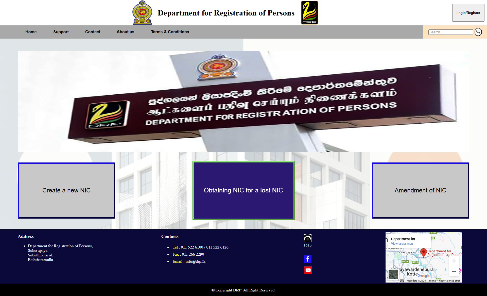
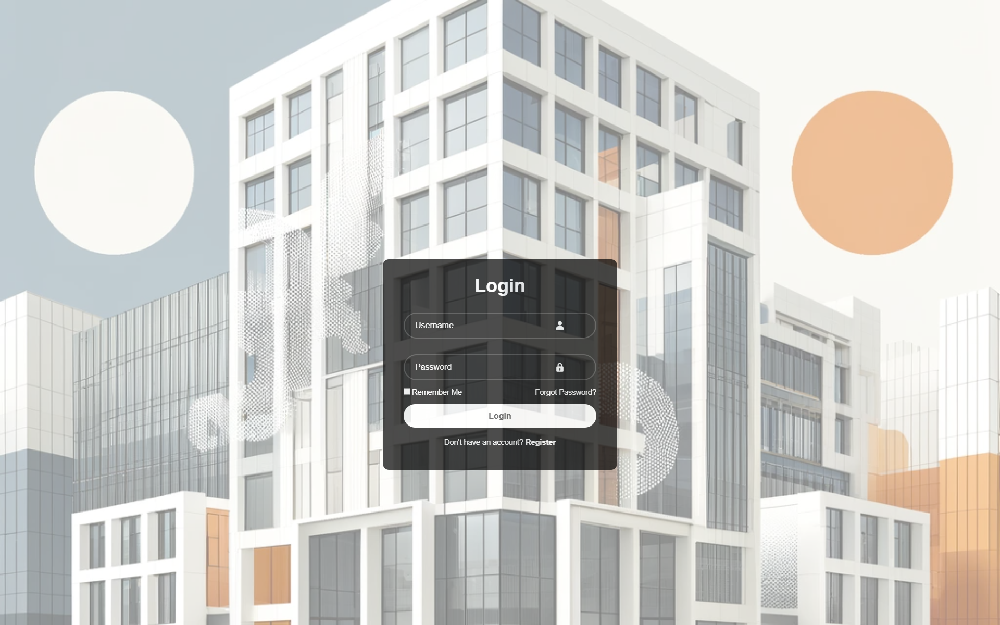

<h1 align="center">🗃 DRP - Digital Registration for Persons System</h1>

  

   A sleek and modern <b>Digital Registration & Payment Web System<b> with NIC Creation functionalities.  

---

## 🛠️ Tech Stack

  
  
  
  
  

---

## 🚀 Features

✅ **User Authentication** – Secure login with "Remember Me" & Forgot Password  
✅ **Smart Registration** – Name, Email, Phone, Gender with validation  
✅ **Secure Payment** – Card Payment form with validation patterns  
✅ **Modern UI** – Responsive, mobile-friendly, hover effects & clean layout  
✅ **Validation Rules** – Strong password, email, phone & card number checks

---

## ⚡ Installation & Usage

# Clone this repository
git clone https://github.com/SNDulnara/DRP-Digital_Registration_of_Persons.git

# Open project folder
cd DRP-Digital_Registration_of_Persons

# Run in browser
open HTML/Login.html

---

## 📸 Preview

| 🏠 Home Page                              | 🔑 Login Page                               
| ------------------------------------------ | --------------------------------------------- 
|  |  |

---

## 🧪 Validation Rules

* 📧 **Email:** Must follow `user@example.com`
* 📱 **Phone:** Exactly **10 digits**
* 🔒 **Password:** ≥ 6 characters & must include a number
* 💳 **Card Number:** 12–16 digits

---

## 👨‍💻 Author

**Sihara Dulnara**
🎓 Undergraduate @ SLIIT – BSc (Hons) in Information Technology

  
  

---

## ⭐ Contributing

Contributions, issues, and feature requests are welcome!
Feel free to fork this repo and submit a PR.

---

## 📜 License

📄 This project is licensed under the **MIT License** – free to use & modify.

---

✨ Made with ❤️ by <b>Sihara</b> ✨

